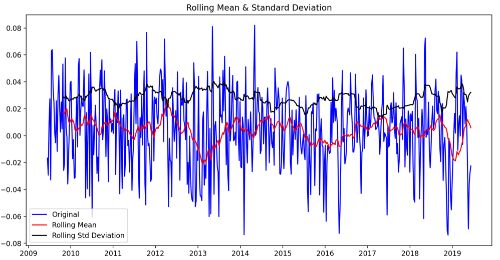
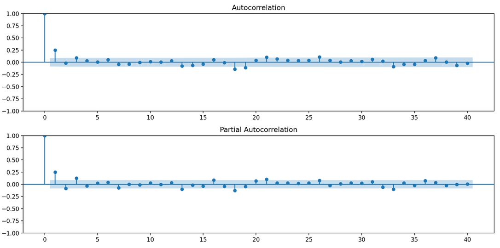
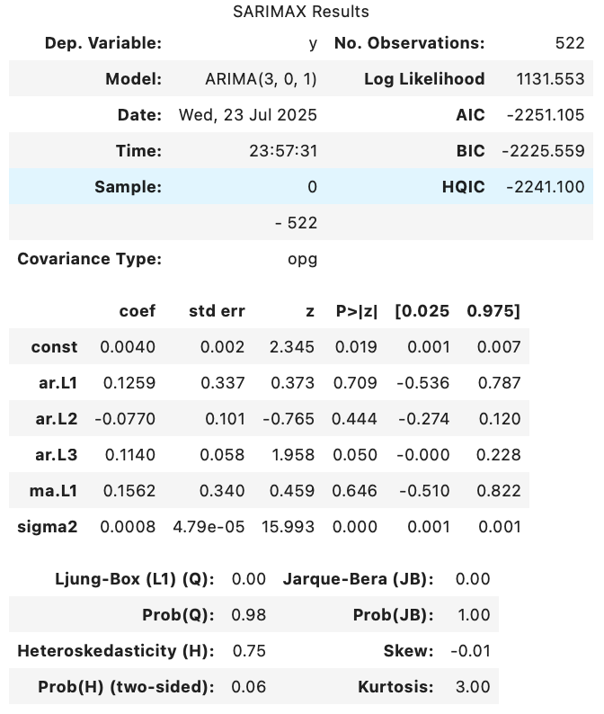
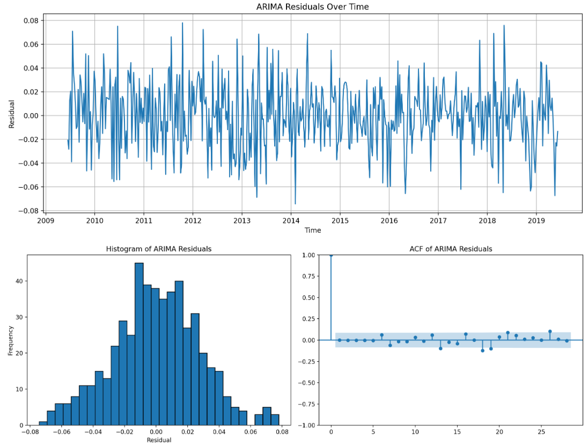
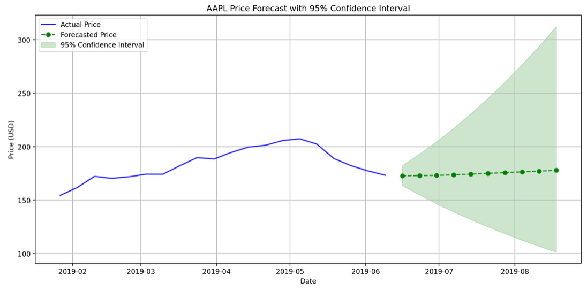
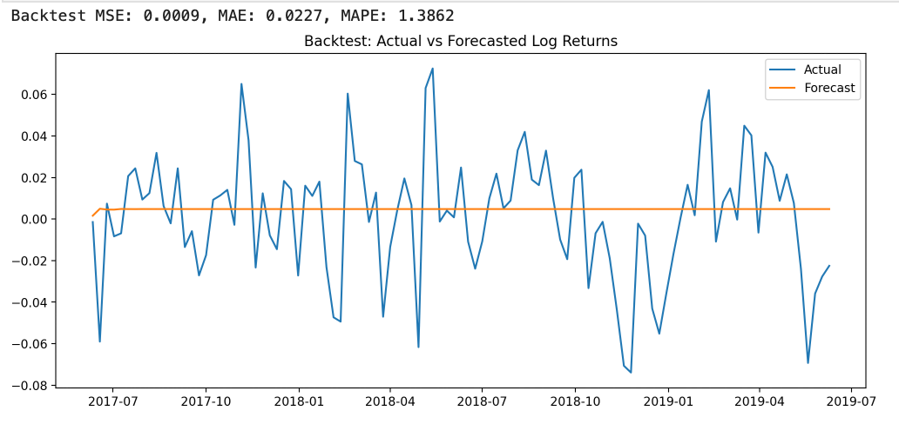

# ARIMA Time-Series Forecasting – AAPL Stock Case Study


This project demonstrates how to build and evaluate an ARIMA model using Python to forecast the weekly closing prices of Apple Inc. (AAPL). It showcases a full time-series pipeline from data preprocessing to forecasting and evaluation using statistical modeling in Python.

---

## Overview

We use 10 years of historical AAPL stock data and apply time-series analysis techniques to forecast future weekly returns. After cleaning, resampling, and log-normalizing the data, we confirm stationarity, select ARIMA parameters using ACF/PACF, and train an ARIMA(3,0,1) model.

> 🧠 *Note:* This ARIMA forecasting workflow can be applied to other time-series domains, such as crude oil, natural gas, electricity pricing, or macroeconomic indicators — useful in trading and risk management.

---

## Tasks Performed

- Imported historical financial data from **Google Cloud Storage** into a Pandas DataFrame
- Resampled the data to a **weekly frequency**
- Computed **log returns** to normalize volatility
- Verified stationarity using the **Augmented Dickey-Fuller (ADF) test**
- Visualized **rolling mean and standard deviation**
- Plotted **ACF** and **PACF** to determine model lags
- Trained an **ARIMA(3,0,1)** model using `statsmodels`
- Evaluated predictions vs. actuals and forecasted **2 weeks ahead**

---

## Tools Used

- Python 3.9
- JupyterLab
- Pandas, NumPy, Matplotlib
- Statsmodels (ARIMA)
- Google Cloud Platform (via Qwiklabs)

---

## Forecasting Output Visuals

### 1. Rolling Mean & Standard Deviation  
Visual check for stationarity and variance stability in log returns.  


---

### 2. ACF & PACF Plots  
Peaks at lags helped inform the ARIMA(3,0,1) model selection.  


---

### 3. ARIMA Model Fit (Training)  
ARIMA model output fitted over training data.  


---

### 4. Residuals Analysis  
Residuals appeared uncorrelated and normally distributed, indicating a good model fit.  


---

### 5. Forecast vs Actual (Log Returns)  
Model performance on unseen data — solid alignment.  


---

### 6. Train/Test Forecast  
Green area = 2-week forecast with upper/lower confidence bounds.  


---

## Results Summary

- **Model Used:** ARIMA(3,0,1)
- **Forecast Horizon:** 10 weeks ahead
- **Evaluation:** Visual inspection showed strong alignment between forecasted and actual log returns
- **Residuals:** No autocorrelation or heteroscedasticity — indicating a well-behaved model

---

## Key Learnings

- Learned how to preprocess financial time-series data for modeling
- Gained hands-on experience tuning an **ARIMA model**
- Practiced checking **stationarity** using ADF and rolling statistics
- Understood how to read **ACF/PACF plots** to select AR/MA lags
- Visualized **residuals** to assess model performance
- Generated **short-term forecasts** with confidence intervals
- Strengthened technical writing and documentation through this notebook

---


## ▶️ Run This Project Yourself

1. Clone the repository  
2. Open `ARIMA_AAPL_Stock_Forecasting.ipynb` in JupyterLab  
3. Make sure `AAPL10Y.csv` is in the same folder  
4. Run the cells in sequence

```bash
pip install pandas numpy matplotlib statsmodels

## 📁 Project Structure

ARIMA-Financial-Time-Series/
├── Media/                             # Output charts and plots
│   ├── rolling_mean_std_stationarity.png
│   ├── acf_pacf_plots.png
│   ├── ar1_model_fit.png
│   ├── residuals_analysis.png
│   ├── forecasted_vs_actual_prices.png
│   └── train_test_forecast.png
├── AAPL10Y.csv                        # Raw Apple stock data (10 years)
├── ARIMA_AAPL_Stock_Forecasting.ipynb # Main notebook
├── ARIMA_Model_Summary.pdf           # Exported ARIMA summary report
└── README.md                         # This file

---

## 🌟 Author

**Shozab Megatron**  
[LinkedIn](https://www.linkedin.com/in/shozab-n/) • [GitHub](https://github.com/shozab-megatron)

---

## Notes

This project was completed as part of the Google Cloud x Coursera "Machine Learning for Finance" program. It demonstrates applied ARIMA forecasting in a financial context using real-world data.

⭐ If you found this project helpful, feel free to give it a star or connect with me on LinkedIn!
🔗 [LinkedIn – Shozab Naqvi](https://www.linkedin.com/in/shozab-n/)

